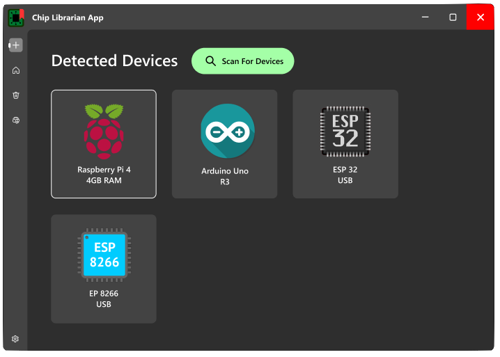
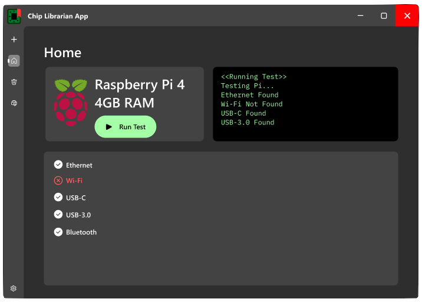
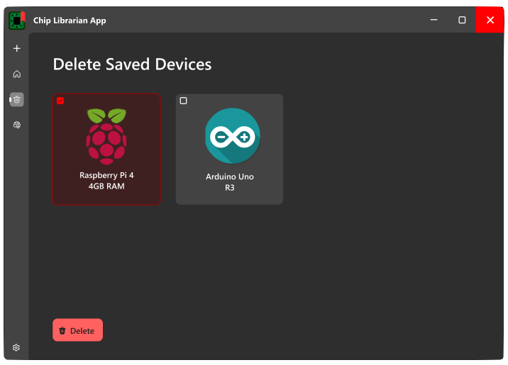
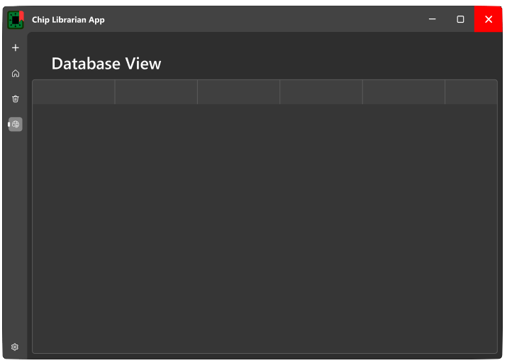
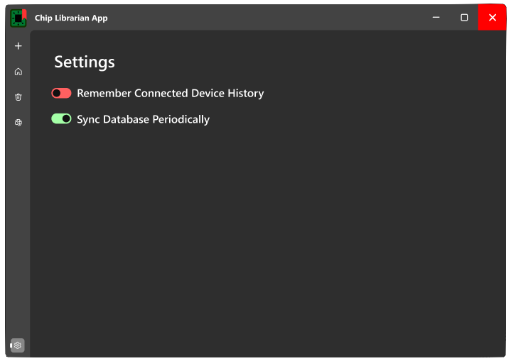

<h3>Initial Design Drafts:</h3>

<ol>
<li><h5>The Device-Adding page</h5>

  

<li><h5>The Home-Page, used to run tests</h5>

  

<li><h5>The Deletion Page, for purging metadata</h5>

  

<li><h5>The DB Page for reviewing and confirming data</h5>

  

<li><h5>The Settings UI</h5>

  
  